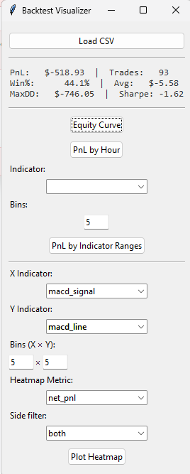
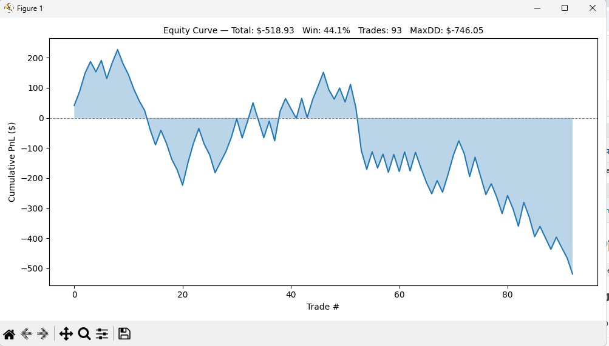
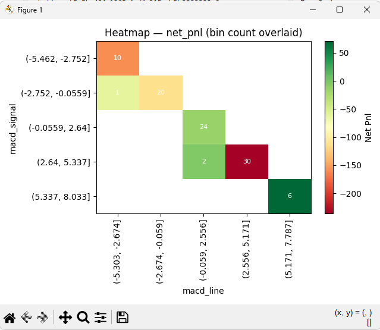

# 📈 Trading Strategy Analyzer



A micro‑futures backtesting framework and interactive analysis toolkit for
evaluating intraday trading strategies on Micro NQ (MNQ) 5‑second bars.



## What's Inside

| File | What it does |
|------|-------------|
| `backtester.py` | Fast NumPy‑vectorised backtester — computes EMAs, MACD, ATR,
ROC, slopes, and runs a configurable entry/exit logic over historical
5‑sec bar data. Saves trade log to `trades.csv`. |
| `visualizer.py` | Tkinter GUI that loads `trades.csv` and provides
interactive plots — equity curve, PnL by hour, PnL bucketed by indicator
ranges, and 2D heatmaps with trade‑count overlays. |

## Quick Start

```bash
pip install -r requirements.txt
```

```bash
# 1. Run the backtest (generates trades.csv)
python backtester.py

# 2. Launch the visualiser
python visualizer.py
```

The visualizer will auto‑load `trades.csv` on startup. Use the **Load CSV**
button to pick a different file.

## Plots

| Plot | Description |
|------|-------------|
| **Equity Curve** | Cumulative PnL with summary stats (total, win rate, trade count, max drawdown) |
| **PnL by Hour** | Net PnL per entry hour (UTC), annotated with trade count |
| **PnL by Indicator Ranges** | Bucket an indicator into N bins and see total PnL per bin |
| **Heatmap** | 2D grid of two indicators — colour = net PnL or win rate, number = trade count. Empty bins render grey. |
| **Side Filter** | All plots can be filtered to show only long / short / both trades |

## Example: Finding Edges with the Heatmap

Load your trades, pick any two indicators for X/Y axes, and the heatmap
will reveal which combinations produce positive vs. negative PnL:



## Data Format

The backtester expects a CSV at `data2.csv` with columns:

| Column | Description |
|--------|-------------|
| `t` | UTC timestamp (parsed by pandas) |
| `o`, `h`, `l`, `c` | Open, high, low, close |
| `v` | Volume |

The backtester filters to weekdays only and drops pre‑computed indicator
columns before the warm‑up period (`MIN_CANDLES` rows).

## Configuration

All strategy parameters live in `StrategyConfig` at the top of
`backtester.py` — MACD periods, ATR multiples, risk percent, threshold
values, etc.

```python
@dataclass
class StrategyConfig:
    MACD_FAST: int = 12
    MACD_SLOW: int = 26
    ATR_TP_MULTIPLE: float = 7.0
    RISK_PERCENT: float = 0.0001
    # ...
```

## License

MIT — do whatever you want with it.
